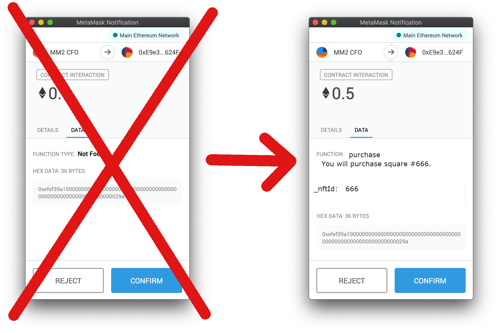

# radspec 🤘

[](https://travis-ci.org/aragon/radspec)
[](https://coveralls.io/github/aragon/radspec)

Radspec is a safe interpreter for dynamic expressions in Ethereum's [NatSpec](https://github.com/ethereum/wiki/wiki/Ethereum-Natural-Specification-Format).

This allows smart contact developers to show improved function documentation to end users, without the [security pitfalls of natspec.js](#aside-why-is-natspecjs-unsafe). Radspec defines its own syntax structure and parses its own AST rather than directly evaluating untrusted JavaScript.



## Features

- **Expressive**: Show relevant details to smart contract end-users at the time they make transactions.
- **External calls**: Radspec can query other contracts.
- **Safe**: Radspec requires no DOM access or untrusted JavaScript evaluation.
- **Compatible**: Most existing NatSpec dynamic expressions are compatible with Radspec.

## Introduction & quick start

Radspec supports any contract programming language, such as Solidity or Vyper because radspec works on the compiled JSON ABI. Here is an example using Solidity.

```solidity
pragma solidity ^0.5.0;

contract Tree {
    /// @notice Set the tree age to `numYears` years
    function setAge(uint256 numYears) external {
        // set the age into storage
    }
}
```

Notice the *dynamic expression* documentation for the `setAge` function. When presented to the end user, this will render based on the inputs provided by the user. For example, if the end user is calling the contract with an input of 10 years, this will be rendered by radspec as:

> Set the tree age to 10 years

Use the Solidity compiler to generate user documentation and ABI with:

```sh
solc --userdoc --abi tree.sol
```

This produces the outputs:

```json
{
  "methods" :
  {
    "setAge(uint256)" :
    {
      "notice" : "Set the tree age to `numYears` years"
    }
  }
}

```

and

```json
[{
  "constant":false,
  "inputs":[{"name":"numYears","type":"uint256"}],
  "name":"setAge",
  "outputs":[],
  "payable":false,
  "stateMutability":"nonpayable",
  "type":"function"
}]
```

Note you can also use [Human-Redable abis](https://blog.ricmoo.com/human-readable-contract-abis-in-ethers-js-141902f4d917). For the above example that would be:

```json
["function setAge(uint256 numYears) public view"]
```
---

Write a simple tool using radspec to interpret this:

```js
import radspec from 'radspec'

// Set userDoc and ABI from above
const expression = userDoc.methods["setAge(uint256)"].notice
const call = {
  abi: abi,
  transaction: {
    to: '0x8521742d3f456bd237e312d6e30724960f72517a',
    data: '0xd5dcf127000000000000000000000000000000000000000000000000000000000000000a'
  }
}
radspec.evaluate(expression, call)
  .then(console.log) // => "Set the tree age to 10 years"
```

Or see more examples [here](examples) and in the [tests](test/examples/examples.js).

Please let us know if there's anything else you'd like Radspec to be able to evaluate by filing an [issue](https://github.com/aragon/radspec/issues/new)!

## Installation

Simply use your favorite Node.js package manager:

```sh
npm i radspec
```

## Documentation

Documentation about radspec and the internals of radspec can be found [here](docs).

## Contributing

TBD

## Aside: Why is natspec.js unsafe?

[natspec.js](https://github.com/ethereum/natspec.js) accepts any valid JavaScript. There are multiple reasons this is a bad idea:

1. You either need to write your own JavaScript VM or use `eval` (unsafe!) from inside JavaScript
2. A fully-featured language with classes, functions and much more is absolutely overkill for something that could be solved with a simple DSL.

As dapps become increasingly complex, it is paramount that tools are written in a way that makes phishing near impossible. Evaluating JavaScript directly makes opens your dapp up to cross-site scripting attacks by users merely submitting a transaction(!).

## License

MIT
